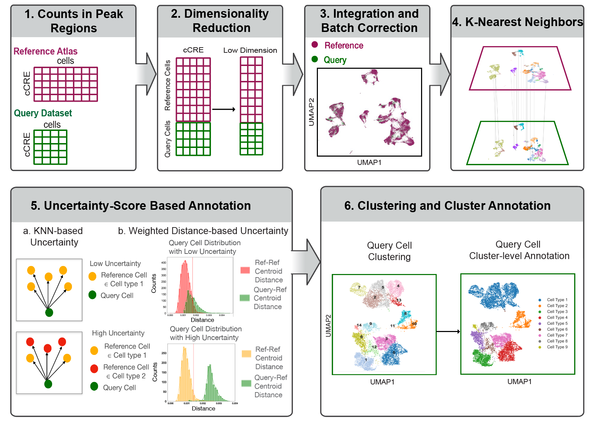

Pipeline Overview
===========================

The conceptual idea and schematic of scATAnno is illustrated here.

Original Input
------------------

The following files are needed to run *Celltype Annotation* on your own experiment:

- *fragments.tsv.gz* fragment file for each scATAC data
- *barcodes.tsv* cell barcodes for each scATAC data
- *reference bed file* reference peaks with chromosome regions for a selected reference atlas

- Optionally: *UMAP* or *tSNE* projection coordinates and *Cluster* cluster numbers of cells can be provided by users

Currently, this package only supports hg38 reference mapping

Intermediate Output
--------------------

The following files are intermediate outputs of *scATAnno* in order to generate a peak-by-cell matrix for query data:

- *matrix.mtx* Sparse matrix files with fragment reads
- *features.tsv* Reference peaks/cis-Regulatory Elements
- *barcodes.tsv* Cell barcodes of high quality cells

Final Output
--------------------
The following files are final outputs of *scATAnno* using the annotation tool:

- *1.Merged_query_reference.h5ad* Anndata of integrated query and reference cells
- *X_spectral_harmony.csv* Harmozied spectral embeddings of integrated data
- *query.h5ad* Anndata of query cells which stores annotation results. This AnnData should include essential prediction results, such as
   - *cluster_annotation* cell type assignment at cluster-level
   - *uncertainty_score* final uncertainty score, which takes the maximum of KNN-based uncertainty and weighted distance-based uncertainty of query cells
